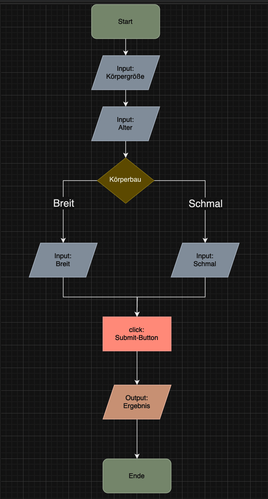

# Projekt Idealgewichtsrechner

### Projektbeschreibung

- Ausrechnen des Idealgewichts für einen breiten Körperbau
- Ausrechnen des Idealgewichts für einen schmalen Körperbau
- Rechnet das Idealgewicht anhand der Körpergröße und des Alters aus
- optimiert für 1440x900px

Hier geht's zur Live-Demo:

https://trisi99.github.io/Idealgewichtsrechner/

### Tools/Technologien

1. HTML
2. CSS
3. JavaScript

### Projekt-Screenshot

### Screenshot_PAP

